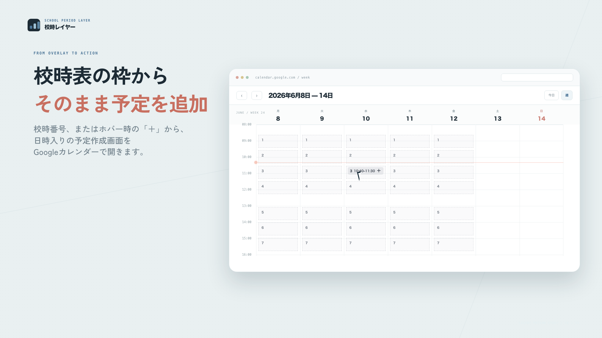

# 校時レイヤー

Googleカレンダーの週表示に、学校の1〜7限を薄いガイドとして重ねるChrome拡張機能です。

予定を増やさず、いつものGoogleカレンダーを校時表に合わせて見やすくします。

<p align="center">
  <a href="./launch-motion/out/school-period-promo.mp4">
    
  </a>
</p>

<p align="center">
  <strong>▶ <a href="./launch-motion/out/school-period-promo.mp4">24秒のデモ動画を見る（無音）</a></strong>
</p>

## まずはChatGPTに導入を手伝ってもらう

パソコンの操作に不安がある場合は、下の枠の右上にあるコピーボタンを押し、内容を[ChatGPT](https://chatgpt.com/)へ貼り付けてください。

ChatGPTが、Windows・Macなどの環境に合わせて、一つずつ導入方法を案内します。

```text
あなたは、パソコン操作に不慣れな教員を支援する案内役です。

私は、次のChrome拡張機能「校時レイヤー」を自分のパソコンへ導入したいです。
https://github.com/nmb1019/school-period-layer

このリポジトリのREADMEを確認したうえで、次の方針で案内してください。

- 最初に、私のパソコンがWindowsかMacかを質問してください。
- 一度に多くを説明せず、1回につき1〜2個の操作だけを示してください。
- 専門用語を避け、画面のどこを選ぶか具体的に説明してください。
- GitHubの「Code」から「Download ZIP」を選ぶ方法、ZIPファイルの展開方法、Chromeの拡張機能画面を開く方法を順番に案内してください。
- 「パッケージ化されていない拡張機能を読み込む」では、manifest.jsonが入っているフォルダを選ぶことを説明してください。
- 各操作のあとに「ここまでできましたか？」と確認し、私の返答を待ってください。
- 表示が説明と違う場合は、個人情報が写っていないスクリーンショットを送るよう案内してください。
- パスワード、APIキー、Googleアカウントの認証情報は不要だと伝えてください。
- 導入後は、Googleカレンダーを週表示にし、拡張機能の設定画面で校時と曜日を設定するところまで案内してください。

では、最初の質問から始めてください。
```

## 自分で導入する

必要なものは、パソコン版のGoogle Chromeだけです。GoogleアカウントのパスワードやAPIキーは使いません。

### 1. ファイルをダウンロードする

1. このページ上部の緑色の「Code」を選びます。
2. 「Download ZIP」を選びます。
3. ダウンロードしたZIPファイルを展開します。

### 2. Chromeへ読み込む

1. Chromeのアドレス欄へ `chrome://extensions` と入力して開きます。
2. 画面右上の「デベロッパーモード」をオンにします。
3. 「パッケージ化されていない拡張機能を読み込む」を選びます。
4. 展開した `school-period-layer-main` フォルダを選びます。

選ぶフォルダの直下に `manifest.json` が見えていれば正しい場所です。

### 3. Googleカレンダーで使う

1. [Googleカレンダー](https://calendar.google.com/)を開きます。
2. 表示を「週」に切り替えます。
3. Chrome右上の拡張機能アイコンから「校時レイヤー」を選びます。
4. 「設定を開く」を選び、表示する曜日と各校時の開始・終了時刻を設定します。
5. Googleカレンダーを再読み込みします。

## できること

- 月曜日から金曜日など、指定した曜日だけ校時表を表示できます。
- 1〜7限の開始・終了時刻を学校の時間割に合わせられます。
- 校時番号または「＋」から、その日時が入ったGoogleカレンダーの予定作成画面を開けます。
- 校時表の罫線や背景の濃さを選べます。
- 今日だけ、または今週だけ、一時的に非表示にできます。

## 大切な仕様

- 校時表は画面上へ重ねているだけで、Googleカレンダーの予定として登録されません。
- 「＋」を選んでも自動保存はされません。内容を確認し、Googleカレンダー側で「保存」を選びます。
- Googleカレンダーに登録されている予定の内容は読み取りません。
- 設定はChrome内の `chrome.storage.local` に保存されます。
- Google Calendar API、OAuth、外部サーバーは使いません。

## うまく表示されないとき

1. Googleカレンダーが「週」表示になっているか確認します。
2. `chrome://extensions` で「校時レイヤー」の「再読み込み」を選びます。
3. Googleカレンダーのページも再読み込みします。
4. 拡張機能の設定で、今日の曜日と校時が有効になっているか確認します。
5. 読み込み時に選んだフォルダの直下に `manifest.json` があるか確認します。

Googleカレンダー側の画面構成が変わると、校時表を表示できなくなる場合があります。位置を正しく判定できないときは、誤った場所へ表示しない設計です。

## 更新する方法

この方法で導入した拡張機能は自動更新されません。新しい版が公開された場合は、ZIPファイルを再度ダウンロードして展開し、`chrome://extensions` で古い版を削除してから新しいフォルダを読み込んでください。

<details>
<summary>開発者向け情報</summary>

### ファイル構成

- `manifest.json`：Manifest V3の設定
- `shared.js`：設定データ、日付・時刻処理、入力検証、予定作成URL
- `content.js` / `content.css`：Googleカレンダーへ校時レイヤーを表示
- `popup.*`：全体ON/OFF、今日・今週だけの一時非表示
- `options.*`：校時、曜日、休業期間、表示濃さの設定画面
- `service-worker.js`：初期設定の準備
- `launch-motion/`：README上部の無音デモ動画を生成するRemotionプロジェクト

### 動画を再生成する

```bash
cd launch-motion
npm install
npm run typecheck
npm run render
```

</details>
